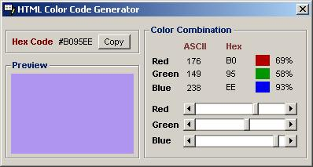



## Hex Color Code Generator 1\.0

### Description

With this handy tool you can try different color combination to get right one for your web pages.It gives you Hex code for selected color, which you can straight copy paste to your pages.All Web developer must have this tool.I am working on it to make it more usefull.The next version will allow you to save your custom color to collection,which you can easily import export to xml and other file formats.Thanks.
 
### More Info
 

             |
---                |---
**Submitted On**   |2003-03-28 22:20:14
**By**             |[Mihir Solanki](https://github.com/Planet-Source-Code/PSCIndex/blob/master/ByAuthor/mihir-solanki.md)
**Level**          |Intermediate
**User Rating**    |5.0 (15 globes from 3 users)
**Compatibility**  |VB 6\.0
**Category**       |[Internet/ HTML](https://github.com/Planet-Source-Code/PSCIndex/blob/master/ByCategory/internet-html__1-34.md)
**World**          |[Visual Basic](https://github.com/Planet-Source-Code/PSCIndex/blob/master/ByWorld/visual-basic.md)
**Archive File**   |[Hex\_Color\_1566893312003\.zip](https://github.com/Planet-Source-Code/mihir-solanki-hex-color-code-generator-1-0__1-44323/archive/master.zip)

